# Kids Scroll 🎈 — Safe, Offline Learning Playground for Kids

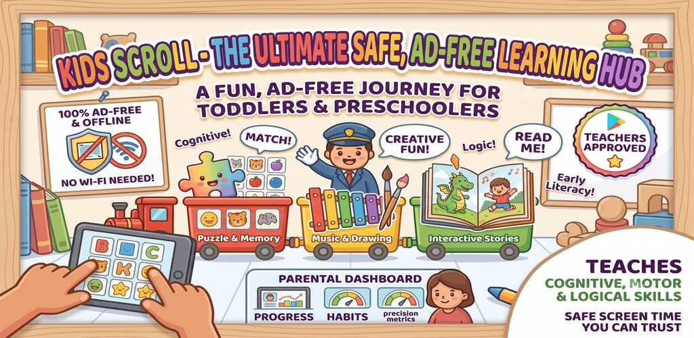

### **Turn Screen Time into Skill-Building Time.**
*A 100% kid-safe, ad-free, and interactive educational playground designed for toddlers, preschoolers, and young children (Ages 1–6).*

[-FF9800?style=for-the-badge)](#)

---

### **Download Kids Scroll Today**

&nbsp;&nbsp;&nbsp;&nbsp;

**🌐 Or Play Directly in Browser (PWA):** [www.offlinekidsgames.com](https://www.offlinekidsgames.com/)

---

## 🌟 Why Kids Scroll?

### The Digital Dilemma: Saving Kids from Mindless Video Scrolling
Every parent knows the scene: you need 15 minutes of uninterrupted time to cook dinner, handle a work call, or navigate a long car ride. You hand your smartphone to your toddler, and within seconds they are doing what they see everyone else doing — **scrolling**.

However, mainstream video platforms, social feeds, and casual games come with hidden hazards:
- ❌ **Addictive Algorithmic Feeds**: Auto-playing video loops and short-form reels engineered to exploit dopamine receptors and shorten attention spans.
- ❌ **Hyper-Stimulating & Strobing Visuals**: Rapid frame cuts, flashing strobe animations, and chaotic transitions that overstimulate young developing nervous systems and trigger sensory overload and dysregulation.
- ❌ **Risky Action Buttons**: Dangerous taps that accidentally send messages to contacts, make unauthorized phone calls, trigger in-app credit card purchases, or navigate outside the app to external web links.
- ❌ **Hidden Subscriptions & Paywalls**: Frustrating lockouts, interstitial video ads, and pay-to-win prompts targeted at vulnerable toddlers.

  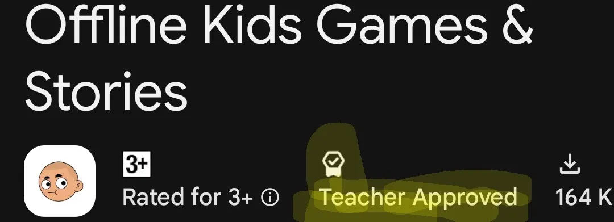
  
<em>Officially vetted and Teacher Approved on Google Play for developmental safety and educational excellence.</em>

### The Kids Scroll Difference: Active Discovery, Not Passive Consumption
**Kids Scroll turns the natural scrolling instinct into a healthy, positive, skill-building experience.** 

When a toddler scrolls in Kids Scroll, they aren't passively consuming an endless feed of junk videos. Instead, every scroll and tap triggers **tactile learning, cognitive engagement, and cause-and-effect discoveries**:
- **Zero Action Traps**: No share buttons, no comment forms, no dialing buttons, and no in-app purchases.
- **Calm, Mindful Pacing**: Thoughtfully crafted **free from strobing visuals**, chaotic screen shaking, and jarring sounds.
- **Self-Directed Play**: Intuitive gesture controls, large touch targets, and magnetic snapping built specifically for little hands.

---

## 👨‍👩‍👧‍👦 The All-in-One Parent Solution: One App Instead of Dozens

As parents, our phones often get cluttered with 15 to 20 different single-purpose apps: one app for drawing, another for animal sounds, a third for toddler tracing, separate apps for bedtime stories, puzzle games, flashcards, and rhyming poems.

> ### 💡 Stop App Clutter — Everything in One Safe Place
> **With Kids Scroll, parents no longer need to download, manage, or pay for multiple separate apps.** 
> Kids Scroll consolidates **50+ interactive learning games**, **60+ read-aloud audio stories**, and **3,800+ curiosity wonders** into a single, beautifully organized hub. Instant access, zero loading times, and zero subscriptions.

---

## 🚀 Core Value Highlights

| Feature | What It Means for You and Your Child |
| :--- | :--- |
| 🆓 **Forever Free** | 100% free with no paywalls, no trial periods, no locked tiers, and zero in-app purchases. Every child deserves equal access to quality early learning. |
| 🔒 **No Registration** | Instant plug-and-play. No accounts, no email logins, no passwords, and no personal data collection. Your child's privacy is 100% protected. |
| ✈️ **Complete Offline Support** | Fully precached on install. Works seamlessly on airplanes, road trips, doctor waiting rooms, or remote locations without Wi-Fi or mobile data. |
| 🎨 **Interactive Visuals & Audio** | Cheerful, positive voice narration, celebratory confetti animations, tactile physics, and 60+ real animal and mechanical sounds. |
| 🌿 **Free from Strobing Visuals** | Calm, sensory-friendly visual design. Gentle colors, soft motion curves, and zero rapid-fire flashes, protecting young eyes and fostering deep focus. |
| 📊 **Built-in Parental Dashboard** | On-device, private analytics displaying playtime, focus duration, and milestones across fine motor skills, logic, and early literacy. |

---

## 🎯 Three Pillars of Learning & Exploration

Kids Scroll organizes learning into three distinct, research-backed pillars:

```mermaid
graph TD
    KS["🎈 Kids Scroll Learning Ecosystem"]
    
    KS --> P1["🎮 Play & Learn (50+ Games)"]
    KS --> P2["📖 Story & Rhymes (60+ Tales)"]
    KS --> P3["💡 Questions & Facts (76 Topics / 3,800+ Facts)"]
    
    P1 --> G1["Fine Motor Skills"]
    P1 --> G2["Problem Solving & Logic"]
    P1 --> G3["Hand-Eye Coordination"]
    P1 --> G4["Cognitive Skills & Early Literacy"]
    P1 --> G5["Sorting & Categorization"]
    P1 --> G6["Music & Rhythm"]
    P1 --> G7["Sensory & Calming"]
    
    P2 --> S1["Pet & Wild Animals"]
    P2 --> S2["Daily Routines & Sleep"]
    P2 --> S3["Potty Training & Growth"]
    P2 --> S4["Emotions & Big Feelings"]
    P2 --> S5["On-Device AI Story Engine"]
    
    P3 --> Q1["Animals & Nature"]
    P3 --> Q2["Vehicles & Science"]
    P3 --> Q3["Everyday Wonders & Body"]
    P3 --> Q4["Spoken Audio Narration"]
```

---

### Pillar 1: 🎮 Play & Learn (50+ Mindful Offline Games)

Designed for toddlers and preschoolers (Ages 1–6), each game targets essential cognitive and physical milestones while keeping play delightful and frustration-free.

  <table>
    <tr>
      <td align="center">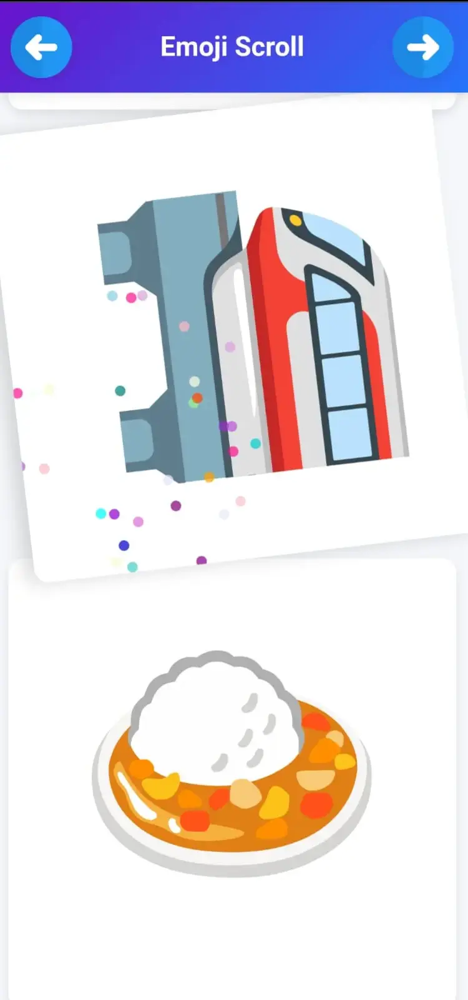 <b>Avatar Scroll</b></td>
      <td align="center">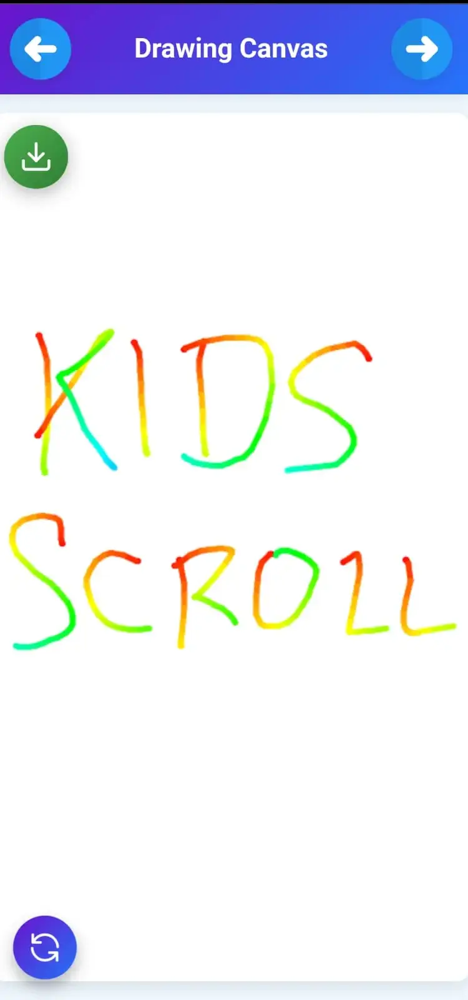 <b>Drawing Canvas</b></td>
      <td align="center">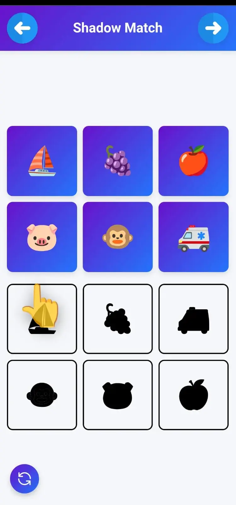 <b>Shadow Match</b></td>
      <td align="center">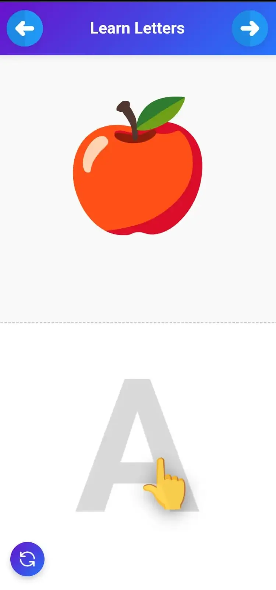 <b>Learn Letters</b></td>
    </tr>
    <tr>
      <td align="center">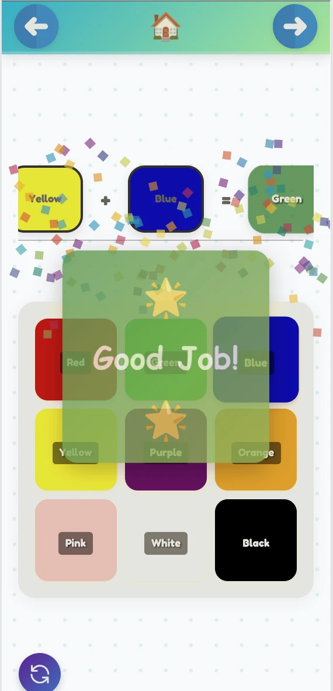 <b>Color Mixture</b></td>
      <td align="center">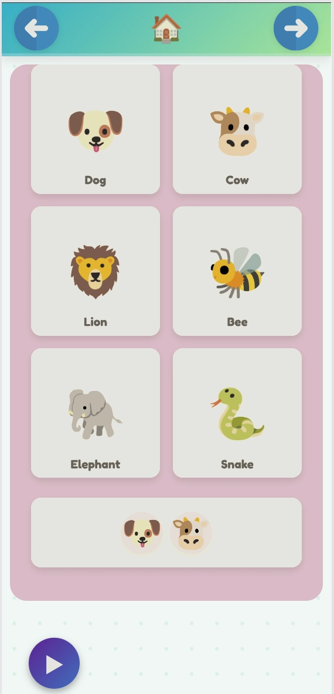 <b>Animal Beatbox</b></td>
      <td align="center">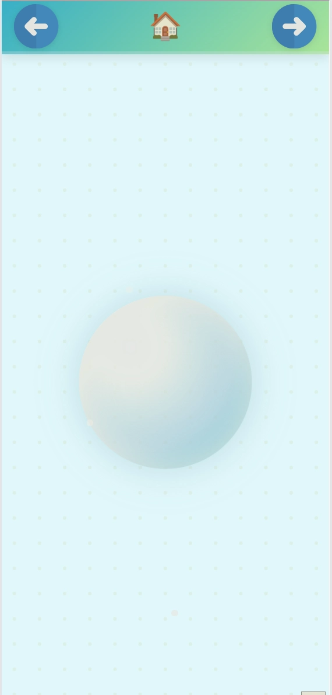 <b>Breathing Bubble</b></td>
      <td align="center">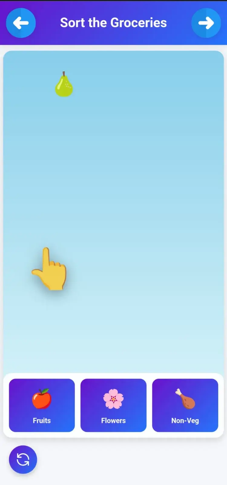 <b>Sort Groceries</b></td>
    </tr>
  </table>

#### 1. Fine Motor Skills & Coordination
*Developing finger dexterity, pincer grasp, and bilateral hand control through fluid gestures.*
- **Infinite Avatar Scroll**: Endless, satisfying scrolling with 360° interactive avatar tap animations.
- **Drawing Canvas & Finger Painting**: Digital easel with rich VIBGYOR colors, adjustable brush strokes, and instant clearing.
- **Scrub the Mud**: Mud-cleaning canvas where wiping reveals friendly hidden animals underneath.
- **Emoji Jigsaw**: Simple, magnetic snap puzzles teaching part-to-whole spatial relationships.
- **Garden Growing**: Tap seeds, water sprouting shoots, and watch vibrant flowers blossom.
- **Bubble Wrap Pop**: Tactile, stress-free virtual popping with realistic auditory feedback.
- **Connect the Dots & Trace the Path**: Guided numbered star connections and winding obstacle paths.

#### 2. Problem Solving & Early Logic
*Cultivating deductive reasoning, pattern recognition, and spatial intelligence.*
- **Shadow Match**: Match high-contrast animal and object silhouettes to their vibrant originals.
- **Spot the Pair**: Visual memory grid matching pairs of cheerful emojis.
- **Shape Sorter & Size Sorter**: Differentiating circles, triangles, stars, and scaling from small to large.
- **Pattern Maker**: Completing sequences and anticipating logical progressions.
- **Build the Zoo**: Classifying and grouping animals into appropriate natural enclosures.
- **Selective Bubble Pop**: Targeted listening exercises — pop only fruits, vehicles, or specific shapes!
- **Bake a Cake**: Follow sequential recipe steps: mix ingredients, pour batter, and bake to completion.

#### 3. Hand-Eye Coordination & Reflexes
*Sharpening visual tracking, timing anticipation, and neural reaction speed.*
- **Rocket Burst**: Pop flying rockets mid-air to trigger colorful, safe fireworks.
- **Make Fruit Salad**: Slice flying fruits with quick finger swipes while avoiding distractions.
- **Balloon Pop**: Tap rising pastel balloons with realistic floating physics.
- **Whack-a-Mole**: Classic, gentle reflex challenge with friendly peeking critters.
- **Traffic Light**: Teaching red/stop and green/go causality through timing control.
- **Catch the Treats & Bouncing Buddy**: Precision tracking of falling treats and hopping characters.

#### 4. Cognitive Skills & Early Literacy
*Building early phonics, foundational numeracy, and time awareness.*
- **Learn Letters & Learn Numbers**: Stroke-by-stroke letter and numeral tracing with audio reinforcement.
- **Count with Me**: Visual counting games linking spoken numbers to physical quantities.
- **Guess the Time**: Interactive clock face matching hour hands to daily routine events.
- **Day and Night**: Interactive sky switch demonstrating circadian transitions from sun to moon.
- **Build a Face & Emotion Explorer**: Identifying facial expressions and naming feelings (happy, sleepy, surprised).
- **Who Makes This Sound?**: Match authentic animal calls to the correct photo/illustration.

#### 5. Sorting & Categorization
*Developing mental schema, taxonomic sorting, and functional relationships.*
- **Sort the Groceries**: Categorizing food into pantry, fridge, and fruit baskets.
- **Color Train**: Matching colorful cargo into coordinating train carriages.
- **Color Mixture**: Hands-on blending of primary colors (Red + Blue = Purple) to explore color science.
- **Where Do They Live?**: Habitat sorting (Jungle, Ocean, Farm, Arctic, Desert).
- **Hot & Cold Sorter / Land, Sea, or Air**: Classifying items by temperature and vehicle modes of travel.

#### 6. Music & Rhythm
*Auditory discrimination, tempo awareness, and musical play.*
- **Animal Beatbox**: Combine pig oinks, frog croaks, and duck quacks into custom rhythmic beats.
- **Emoji Xylophone**: Tuned 8-note chime bar with colorful visual sound waves.
- **Musical Instruments**: Exploring guitars, pianos, drums, and flutes with real acoustic clips.

#### 7. Sensory & Relaxation
*Self-regulation tools designed for winding down before naps and bedtime.*
- **Breathing Bubble**: Expanding and contracting visual guide for deep toddler breathing.
- **Magic Sand**: Relaxing particle swirls reacting smoothly to slow finger drags.
- **Flashlight Explorer**: Peek-a-boo exploration using a virtual flashlight beam in the dark.
- **Egg Hatching**: Gentle repetitive tapping revealing baby chick surprises.

---

### Pillar 2: 📖 Story & Rhymes (60+ Interactive Read-Aloud Tales)

  
  
<em>Synchronized sentence-by-sentence read-aloud highlighting with calming animated scenes.</em>

Reading aloud is the single greatest predictor of early language acquisition. Kids Scroll's **Story & Rhymes** pillar delivers gentle, beautifully structured read-aloud storybooks complete with **word-by-word visual highlighting**, soothing narration, and interactive character stages.

#### Subcategories Covered:
1. 🐶 **Pet Animal Adventures**: Relatable fables featuring Buster the Dog, Barnaby's muddy adventures, and cozy kittens.
2. 🦁 **Wild Animal Tales**: Inspiring journeys of brave lions, patient tortoises, helpful elephants, and curious monkeys.
3. 🪥 **Daily Routines & Self-Care**: Engaging stories that model daily habits: brushing teeth, taking warm bubble baths, tidying up toy blocks, and winding down for sleep.
4. 🚽 **Potty Training Journeys**: Positive, pressure-free reinforcement stories celebrating potty milestones.
5. 🥦 **Healthy Eating**: Exploring colorful "rainbow plates" and encouraging mealtime manners.
6. 🎒 **Play School & Sharing**: Preparing little ones for preschool, taking turns, and making new friends.
7. ❤️ **Big Feelings & Emotional Growth**: Helping children label anger, navigate sadness, practice empathy, and discover gentle calming strategies.
8. 🦸 **Brave Little Hero & Safety**: Overcoming fear of the dark, doctor visits, and simple road safety rules.

#### 🤖 Privacy-Preserving On-Device AI Story Generation
In addition to dozens of hand-curated classic tales, Kids Scroll includes an offline, on-device language model (`wllama.wasm` with `story-model.gguf`, ~27MB). 
- Generates endless fresh, sweet bedtime fables for 18+ animal characters.
- **100% On-Device & Zero Cloud Calls**: Generated entirely locally within your browser or app runtime — zero personal data or voice recordings ever leave your phone!
- **Strict Content Safeguards**: Hardcoded kid-safety vocabulary filters ensure stories remain positive, gentle, and moral-focused.

---

### Pillar 3: 💡 Questions & Facts / Wonders & Facts (76 Topics / 3,800+ Facts)

Curious toddlers ask *"Why?"* dozens of times every day. **Wonders & Facts** is an interactive, spoken-audio encyclopedia built specifically for little inquiring minds.

  <table>
    <tr>
      <td align="center"><b>🦁 Animals & Wildlife</b> Whale songs, cheetah speed, owl night vision</td>
      <td align="center"><b>🚗 Vehicles & Transport</b> Steam trains, fire engines, helicopters, rockets</td>
      <td align="center"><b>🏫 Places Around Us</b> Libraries, playgrounds, supermarkets, farms</td>
      <td align="center"><b>🌍 Nature & Weather</b> How rainbows form, snow crystals, ocean waves</td>
    </tr>
    <tr>
      <td align="center"><b>🎈 Everyday Things & Science</b> Magnets, mirrors, shadows, soap bubbles</td>
      <td align="center"><b>🥦 Food & Plants</b> How seeds grow, honeybees, crunchy carrots</td>
      <td align="center"><b>🚀 Space & Sky</b> Craters on the moon, shooting stars, the sun</td>
      <td align="center"><b>🍎 My Body & Health</b> Why we yawn, beating hearts, strong teeth</td>
    </tr>
  </table>

- **Tap-to-Listen Audio**: Powered by natural speech synthesis, non-readers can tap any wonder card to hear it read aloud in a friendly, conversational tone.
- **Authentic Sound Effects**: Over 60+ embedded real-world audio samples (real lion roars, train whistles, water splashes) to provide rich sensory context.
- **Bite-Sized Clarity**: Complex concepts translated into simple, memorable 2-3 sentence explanations that foster vocabulary without cognitive overload.

---

## 📊 Parental Stats Dashboard

Kids Scroll gives parents complete transparency into their child's digital playtime and cognitive development:

  
  &nbsp;&nbsp;&nbsp;&nbsp;
  

- **Playtime & Session Tracking**: See daily and weekly active minutes to manage screen time boundaries effectively.
- **Skill Progression Metrics**: Track which developmental categories (Motor Skills, Logic, Coordination, Literacy) your child engages with most.
- **Favorites & Interests**: Discover which animals, topics, and games spark your child's natural passions.
- **100% Local Storage**: All stats live strictly in the device's local storage (`localStorage`) — zero accounts, zero trackers, and zero server logging.

---

## 🔒 Safety & Parental Tips

### Recommended: Android App Pinning
To give yourself total peace of mind when handing your phone or tablet to your toddler:
1. Open **Kids Scroll**.
2. Swipe up to your **Recent Apps** overview screen.
3. Tap the Kids Scroll app icon dropdown and select **Pin** (or *App Pinning*).
4. *Result*: Your toddler cannot switch to WhatsApp, YouTube, the dialer, or your home screen without entering your phone's PIN or fingerprint!

---

## 🌐 The Extended Learning & Parenting Ecosystem

Kids Scroll is part of a larger mission to nurture happy, healthy, and resilient children. Together with our companion platforms **JuniorGenius.Club** and **Toddlers.Info**, we provide a 360-degree support system spanning cognitive science, purposeful play, and daily developmental routines.

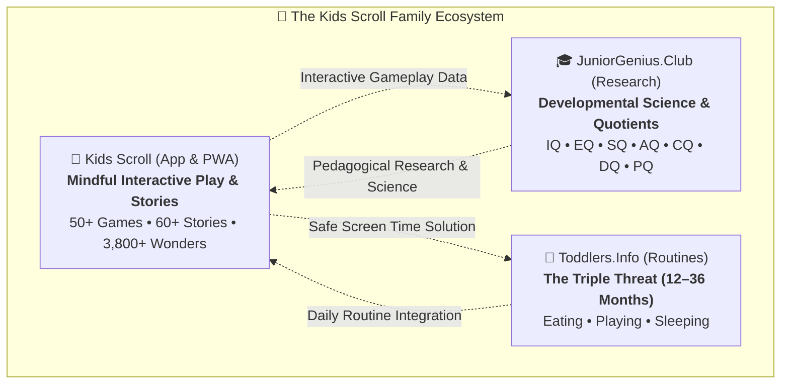

---

### 🎓 JuniorGenius.Club — The Cognitive Science Behind Kids Scroll

  <a href="https://www.juniorgenius.club/" target="_blank" rel="noopener noreferrer">
    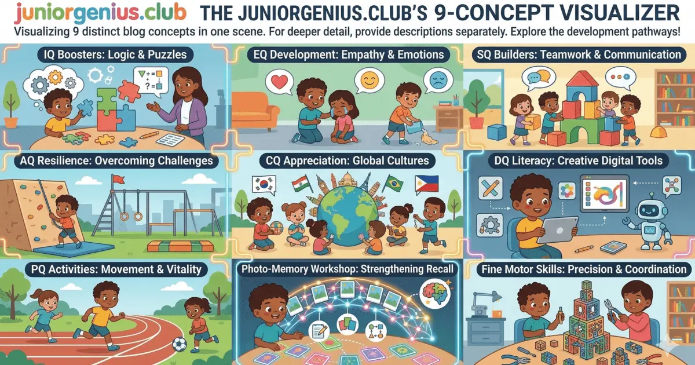
  </a>
  
<em>The JuniorGenius.Club developmental framework: mapping play mechanics to multi-dimensional quotients.</em>

**[JuniorGenius.Club](https://www.juniorgenius.club/)** is a dedicated research publication and educational platform exploring the holistic development of toddlers and preschoolers. Every game mechanic in Kids Scroll is directly grounded in early childhood psychology and cognitive neuroscience insights published on JuniorGenius.

#### The 7 Core Developmental Quotients:

| Quotient | Developmental Focus | How Kids Scroll Develops It |
| :--- | :--- | :--- |
| 🧠 **IQ (Intelligence Quotient)** | Spatial reasoning, logic, geometry, and fluid intelligence | Games like **Shadow Match**, **Shape Sorter**, **Pattern Maker**, and **Size Sorter** build internal cognitive templates and sequence deduction. |
| ❤️ **EQ (Emotional Quotient)** | Emotional literacy, facial cue decoding, and self-soothing | **Emotion Explorer** and **Build a Face** teach children to label big feelings, while **Breathing Bubble** provides a visual anchor for emotional regulation. |
| 🤝 **SQ (Social Quotient)** | Turn-taking, empathy, and social boundaries | **Traffic Light** reinforces social stop-and-go self-control, while read-aloud fables model sharing, empathy, and kindness. |
| 🛡️ **AQ (Adversity Quotient)** | Resilience, grit, and navigating "safe struggle" | Games like **Emoji Jigsaw** offer low-frustration puzzle solving with zero time-out penalties, teaching persistence through trial and error. |
| 🌍 **CQ (Cultural Quotient)** | Environmental awareness and global biodiversity | **Where Do They Live?**, **Build the Zoo**, and animal stories introduce children to worldwide wildlife habitats, oceans, and savannas. |
| 📱 **DQ (Digital Quotient)** | Mindful digital habits and intentional engagement | Built completely **ad-free and free from strobing visuals**, fostering calm, active interactions instead of passive dopamine-driven doomscrolling. |
| 🏃 **PQ (Physical Quotient)** | Fine motor dexterity, pincer grasp, and reflex speed | **Scrub the Mud**, **Finger Painting**, and **Rocket Burst** accelerate neural myelination, hand-eye precision, and tool-handling readiness. |

#### Foundational Abilities Developed Through Research:
- **Photo-Memory & Visual Spatial Recall**: Grid-based memory matching (**Spot the Pair**) trains visual-spatial working memory, helping children form mental filing systems.
- **Reflex Speed & Myelination**: Calibrated tap games (**Whack-a-Mole**, **Balloon Pop**) strengthen neural pathways between visual stimuli and motor response without hyper-arousal.
- **Pincer Grasp & Handwriting Readiness**: Free-hand digital tracing and dragging (**Learn Letters**, **Trace the Path**, **Drawing Canvas**) build finger strength and coordination, transitioning tiny hands smoothly to physical pencils.
- **Auditory Discrimination**: Sound identification (**Who Makes This Sound?**, **Musical Instruments**) trains phonological awareness, the essential precursor to speech and reading.

> 🔗 **Explore in-depth developmental guides:** [www.juniorgenius.club](https://www.juniorgenius.club/)

---

### 🍼 Toddlers.Info — Holistic Parenting Routines & "The Triple Threat"

  <a href="https://www.toddlers.info/" target="_blank" rel="noopener noreferrer">
    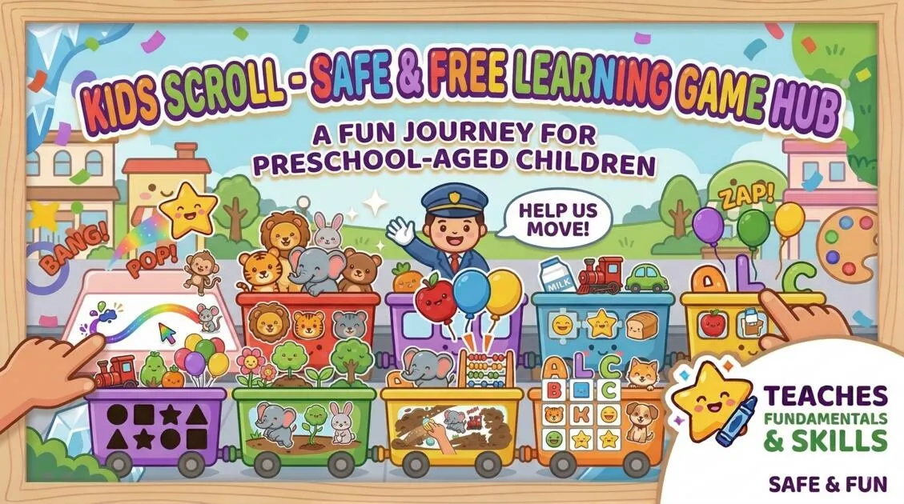
  </a>
  
<em>Practical, milestone-targeted daily schedules and routines for toddlers aged 12 to 36 months.</em>

**[Toddlers.Info](https://www.toddlers.info/)** is an authoritative resource created for parents navigating the rewarding yet challenging toddler years (12–36 months). Built by experienced parental advisors, it demystifies toddler growth by focusing on **"The Triple Threat"** of early childhood:

#### 1. 🥣 Eating & Nutrition Schedules
- **Month-by-Month Feeding Routines**: Calibrated meal and snack schedules tailored for 12, 14, 16, and 17+ month toddlers.
- **Self-Feeding & Pincer Grasp**: Transitioning from purees to finger foods, encouraging cutlery independence and hand-to-mouth coordination.
- **Brain & Body Fuel**: Science-backed dietary guidance highlighting Omega-3 fatty acids for brain myelination, calcium for bone density, iron-rich menus, and gut-healthy probiotics.
- **Tackling Picky Eating**: Practical strategies to overcome mealtime battles through positive sensory food exploration.

#### 2. 🧸 Purposeful Play & Balanced Screen Time
- **Milestone-Targeted Play**: Balancing energetic physical gross-motor play with quiet, focused cognitive stimulation.
- **Mindful Screen Integration**: Recommending Kids Scroll as the gold standard for parent-approved digital play — offering an engaging, educational alternative during travel, doctor waits, or quiet afternoon resets.
- **Social & Creative Milestones**: Supporting parallel play, early literacy through story narration, and mess-free creative finger painting.

#### 3. 🌙 Restorative Sleep Hygiene & Calming Rituals
- **Daytime Nap Consistency**: Strategies for navigating the challenging transition from two naps down to one single afternoon nap.
- **Sleep Regressions & Nighttime Fears**: Evidence-based solutions for the notorious 16-month sleep regression, separation anxiety, and night terrors.
- **Calm Bedtime Routines**: Step-by-step evening rituals combining warm baths, white noise, and Kids Scroll’s gentle read-aloud bedtime tales (**Buster Finds a Bone**, **Daisy’s Cozy Naptime**) and calming sensory activities (**Magic Sand**, **Flashlight Explorer**) to prepare toddlers for peaceful, restorative sleep.

> 🔗 **Access complete toddler schedules & routines:** [www.toddlers.info](https://www.toddlers.info/)

---

## 📥 Installation & Availability

| Platform | Download Link | Notes |
| :---: | :---: | :---: |
| **Android (Phones & Tablets)** |  | Verified Google Play Teacher Approved App |
| **Amazon Fire Tablets** |  | Optimized for Fire 7, Fire HD 8, Fire HD 10 & Kids Edition |
| **Web Browser (Any Device)** | [🌐 Launch Web App](https://www.offlinekidsgames.com/) | Works on Chrome, Safari, Edge, iPadOS, iOS, & PC |

### Installing Directly via Browser (PWA)
1. Open [www.offlinekidsgames.com](https://www.offlinekidsgames.com/) in Google Chrome or Safari.
2. Tap the **Menu (⋮)** (or Safari Share button ⎋).
3. Select **Add to Home screen** / **Install App**.
4. Kids Scroll installs immediately with its own app icon and launches in full-screen offline mode!

---

## 📜 Development & Principles

Kids Scroll is developed with a strict **Children-First Ethics Pledge**:
- **Zero Ads**: No banner ads, no video commercials, no sponsorships.
- **Zero Dark Patterns**: No fake countdown timers, no artificial scarcity, no surprise popups.
- **Zero In-App Purchases**: Everything is included from day one.
- **Privacy by Design**: No telemetry, no profiling, no third-party ad SDKs.

---

Made with ❤️ for curious little explorers worldwide.

**[🎈 Kids Scroll](https://www.offlinekidsgames.com/)** • **[🎓 JuniorGenius.Club](https://www.juniorgenius.club/)** • **[🍼 Toddlers.Info](https://www.toddlers.info/)** • **[⭐ Google Play](https://play.google.com/store/apps/details?id=com.kidsscroll.www.twa)** • **[🔥 Amazon Appstore](https://www.amazon.com/dp/B0HGT27WR4)**

